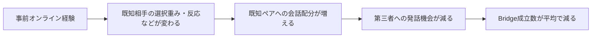

# Bridge vs Island：段階4・5の追加実験報告

2026-09-10。段階1〜3に続き、4の原因経路への介入と、5のボーナス感度分析を実施しました。

## 結論

**今回の4人・12ターンモデルでは、事前オンライン関係による接触相手の配分変化が、Bridge減少につながる経路を確認できました。**
特に既知相手への選択ボーナスの寄与が大きく、既知ペアに会話機会が寄るIsland仮説と整合しました。

ただし、固定したのは「誰が誰にいつ話すか」という相手列全体です。「既知ペア会話の合計回数だけが唯一の原因」「人間でも同じ効果」とまでは確定していません。
以下は、結果を見る前に保存した [実験計画](MECHANISM_PLAN.md) の新規確認ブロック、**seed 101〜1100の1000 seed**の結果です。

## どこまでできたか

| 段階 | 状態 | 内容 |
|---|---|---|
| 1 GitHub版を動かす | 完了 | 元モデル・UIを確認。元の手動clone先自体は未確認 |
| 2 手動で10 seed | 完了 | 引き継ぎ表を全項目再現 |
| 3 100 seed自動実験 | 完了 | 全6ペア・共通4/5ペアの保存と照合 |
| 4 Bridge vs Island | 今回の固定モデルで介入検証完了 | 会話配分計測、作用除去、相手列固定 |
| 5 online_known_bonusを振る | 指定範囲で完了 | 選択5水準×反応4水準、全結果を保存 |
| 6 人数・既知人数・性格 | 未実施 | 現在の結論の適用範囲を広げる次段階 |
| 7 LLMでロバストネス | 未実施 | 将来のAPI利用・費用を含む別作業 |
| 人間への効果 | 未検証 | [人を対象とする研究案](HUMAN_VALIDATION_DRAFT.md) を用意。参加者募集や測定は行っていない |

## 1. 元条件を新しいseedで確認

Bridgeは既知ペアの2人と第三者を結ぶ4候補のうち、「顔見知り」以上になったペアです。親しみを含み、1ペアを1回だけ数えます。

| 指標（1 seedあたり） | A平均 | B平均 | B−A |
|---|---:|---:|---:|
| Bridge成立数（候補4） | 2.342 | 2.098 | −0.244 |
| Bridge成立率 | 58.55% | 52.45% | −6.10ポイント |
| Bridgeの親しみだけ | 1.397 | 1.163 | −0.234 |
| 共通5ペア成立数 | 2.614 | 2.374 | −0.240 |
| 参照ペアの対面化率 | 20.7% | 80.9% | +60.2ポイント |

Bridge件数差の近似95%モンテカルロ区間は **[−0.276, −0.212]**。
Bが多いseedは15、同数747、少ないseedは238でした。
この区間はseed変動による平均推定の精度であり、人間への効果やモデル構造の妥当性の区間ではありません。
探索で見つけた「有意なセル」だけを選ぶ解析は行っていません。

既観測のseed 1〜100も別ブロックで再実行し、前回のA=2.33、B=2.12、差−0.21を再現しました。1000 seedの確認結果にこの100 seedを混ぜていません。

## 2. 本当に既知ペアへ会話が集中したか

| 12ターンの会話配分 | A平均回数 | B平均回数 | B−A |
|---|---:|---:|---:|
| 既知になる参照ペア同士 | 1.502 | 2.373 | +0.871 |
| Bridge候補への会話（両方向） | 8.944 | 8.063 | −0.881 |
| 第三者同士 | 1.554 | 1.564 | +0.010 |
| 合計 | 12 | 12 | 0 |

さらに既知ペアの2人だけに注目すると、各3回、合計6回の発話機会があります。

```text
既知相手へ話す回数 ＋ 第三者へ話す回数 ＝ 6
```

第三者へ発話する回数はA=4.498、B=3.627で、差は **−0.871回**。
既知相手に向ける発話が1回増えると、第三者へ向ける発話が必ず1回減る構造です。
これは平均だけの相関ではなく、全実行で検証した会話予算の恒等式です。
ただし、その機会減少が何件の関係減少になるかは、各ペアへの配分と反応・回数閾値に依存します。

## 3. 原因に介入すると結果は変わるか

次の表はそれぞれの条件の中でのB−Aです。A/B双方に同じルールを適用しています。

| 介入 | Bridge差 B−A | 元条件に対する差の変化 |
|---|---:|---:|
| 元条件：全作用ON | −0.244 | 基準 |
| 選択ボーナスだけ0 | −0.035 | +0.209 |
| 反応ボーナスだけ0 | −0.233 | +0.011 |
| オンライン記憶の話題だけOFF | −0.246 | −0.002 |
| 慎重さの減点免除だけOFF | −0.239 | +0.005 |
| 選択・反応ボーナスは0、話題・減点免除はON | −0.023 | +0.221 |
| 4作用すべてOFF | 0 | +0.244 |
| 全作用ON＋Aの相手列に固定 | 0 | +0.244 |
| 全作用ON＋Bの相手列に固定 | 0 | +0.244 |

選択ボーナス除去による変化+0.209件の近似95%区間は **[+0.180, +0.238]**。
この除去で既知ペア内会話は元条件から平均0.737回減り、その分だけ第三者への発話が戻りました。
ただしボーナス2種類を0にしても差−0.023が残りました。話題・減点免除と、前向き会話後の選択重み加算が残るためです。
全4作用OFFでは1100 seedすべてでA/Bの会話・最終状態が一致しました。状態表示上のオンライン既知はBに残し、行動への作用だけを切っています。

### 会話相手を固定する実験の意味

**Aの相手列を両条件に与えた場合：A=2.342、B=2.342。**
**Bの相手列を両条件に与えた場合：A=2.098、B=2.098。**

成立数だけでなく、Bridgeペアの会話内容・反応・最終状態が各seedの元の提供側と一致しました。
事前経験があるだけでは、同じBridge会話列から違うBridge判定は生まれませんでした。



このモデルでは、関係判定器はそのペアの会話ログだけを見るため、相手列固定は構造に沿った検証です。
接触相手の配分経路をモデル内で確認したものであり、心理的な「内輪化」の実在、人への因果効果、会話総数だけの自然間接効果の証明ではありません。
差が0の区間を表示しているのも「現実に不確実性がない」という意味ではなく、ここでは全対応seedで値が同一だったという意味です。

## 4. ボーナスを強めるとどうなるか

表の数値はBridge成立数の平均B−A。話題利用・減点免除はONに固定しています。
選択ボーナスは相手選択の**重み**への加算であり、そのまま確率の増分ではありません。反応ボーナスは反応点への加算です。

| 選択ボーナス＼反応ボーナス | 0 | 1 | 2（元設定） | 4 |
|---|---:|---:|---:|---:|
| 0 | −0.023 | −0.033 | −0.035 | −0.048 |
| 0.5 | −0.151 | −0.158 | −0.162 | −0.166 |
| 1（元設定） | −0.233 | −0.239 | −0.244 | −0.249 |
| 2 | −0.344 | −0.350 | −0.353 | −0.355 |
| 4 | −0.521 | −0.520 | −0.521 | −0.524 |

調べた範囲では、どの反応ボーナスでも、選択ボーナスを高くしたときの平均差はより負になりました。
反応ボーナスの変化は比較的小さく、全セルで厳密な単調変化があるとは言っていません。
この範囲で平均Bridge増加へ反転する条件は見つかりませんでした。未調査の設定や人物構成まで反転がないとは言えません。

4作用の完全要因計画も実行しました。他の3作用の8背景で平均した主効果は、選択−0.2094、反応−0.0206、話題−0.0091、減点免除−0.0069件でした。
これは上の「元条件から1作用だけ除く効果」と異なる量です。例えば話題の平均主効果と、元条件の背景で話題を切る効果が同じになるとは限りません。
2作用間の差の差も全6組を保存しています。例として反応×話題は+0.0173件で、作用を単純に足すだけの説明には限界があります。これらは感度の記述で、複数比較から有意な効果を選ぶ検定はしていません。

## 何を実装したか

正規の配置は既存ローカル作業コピー内です。新設の `poc/ab_poc/mechanism_experiment.py` が、元の `run_ab()` と前回の `analyze_ab()` を再利用します。

| 新しい関数・クラス | 役割と理由 |
|---|---|
| `Case` / `cases()` | 20セルと16セルの重複4セルを共有し、相手固定2セルを加えた34条件を定義 |
| `config_for()` | 設定ファイルを書き換えず、メモリー内コピーで2種類のbonusを変更 |
| `MechanismInitiator` | 既存話題処理を再利用して記憶利用を切る。相手固定時は抽選を1回消費し、その相手の話題を選ぶ |
| `MechanismResponder` | 元の反応計算にだけ既知フラグを隠して減点免除を解除し、指定の反応bonusは戻す。元の状態は変更しない |
| `observations()` | 既存の共通ペア集計に、会話回数配分と6回の発話予算の検査を追加 |
| `summarize()` | seed内の差、近似区間、作用除去の対比、要因主効果と交互作用を集計 |
| `run_study()` | 計画・設定・照合値を保存し、34条件を実行。完了manifestは最後に保存 |

変更前は「元条件A/B」を実行していました。変更後は例えば次の形で「選択ボーナスだけ0のA/B」を実行できます。これは理解用で、コードを手で変更する必要はありません。

```python
from poc.ab_poc.mechanism_experiment import Case, run_case
result = run_case(Case(selection=0, reaction=2, topic=True, caution=True), seed=1)
```

元エンジン、関係判定器、人物、JSON設定、既存UIは変更していません。元のpocファイル43件が取得アーカイブと同一です。

## 実行とファイル

まずPowerShellで作業コピーへ移動します。

```powershell
Set-Location "<cloneしたリポジトリのフォルダ>"
```

小さい確認（全34条件をseed 101〜103で実行）：

```powershell
.\.venv\Scripts\python.exe -X utf8 -m poc.ab_poc.mechanism_experiment --seed-start 101 --seed-end 103
```

今回と同じ本実験（既観測100 seedと新規1000 seedを区別して保存）：

```powershell
.\.venv\Scripts\python.exe -X utf8 -m poc.ab_poc.mechanism_experiment
```

全34条件×1100 seedで、今回の実測は約145秒、出力合計は約74.5MBでした。環境によって時間は変わります。
日時入りの新しいフォルダーが作られます。過去の結果は上書きしません。APIキー・追加パッケージ・サーバー起動は不要です。

正式な今回のデータは **`results/mechanism-confirmed-001-1100/`** です。

| ファイル | 内容 |
|---|---|
| `case_summary.csv` / `.json` | 全条件・指標を較正100 seed／確認1000 seed別に集計 |
| `contrasts.csv` | 元条件に対して作用を切ったときの対応差 |
| `factorial_effects.csv` | 4作用の主効果と全6組の2因子交互作用 |
| `seed_metrics.csv` | 37400行の条件×seed別集計 |
| `pairs.csv` | 448800行の全ペア状態・会話回数・反応数 |
| `traces.jsonl.gz` | 実際のactor/target/topic/responseと終了状態を残した圧縮ログ |
| `design.json` | 事前計画の照合値、全条件、使用設定 |
| `manifest.json` | 完了状態・件数・実行版・出力照合値 |

`traces` は再集計に必要な縮約ログで、完全なHTTPレスポンスではありません。重複する途中snapshotや表示・感情の詳細を省いています。
発話の声かけ表現も保存を省いており、検証時は人物の性格から既存の関数で再構成しています。関係判定器はその表現を判定に使いません。
本データは37400のA/B組、74800条件実行です。相手列固定等のための元モデル参照1100組＝2200条件実行は、追加の分析標本として数えていません。

補助的な `mechanism-smoke`、`mechanism-profile` は動作確認用です。`mechanism-001-1100` は中断した未完了出力で、解析に採用していません。

## 検証と残る限界

- 23テスト成功。前回の12テストを含め、介入の独立性、全作用ONの元モデル完全一致、全作用OFFの行動一致、相手列固定の再現、既知の式に対する要因効果計算、保存・再構成・上書き保護を確認。
- 本実験全件でAが自然条件から変わらない35200件、全作用OFFの一致1100件、固定相手の提供側Bridge再現4400件、元条件の完全一致1100件を確認。
- 保存ログを既存の関係判定器へ再投入して448800ペアを再構成。CSV、JSON、対比・要因集計が元ログと一致。欠損・重複なし。
- 前回の100 seed・1200ペアの監査も再通過。元の43ファイルは同一。
- Pythonコンパイル確認済み。既存HTTPサービスは前回の動作確認があり、今回はそのコードを変更していない。新コマンドは別プロセスでスモーク確認。
- 証拠は `validation/mechanism-tests.txt`、`validation/mechanism-confirmed-001-1100-audit.json`、`validation/mechanism-confirmed-console.txt`。
- 同じseedの再実行は再現性確認であり、独立標本の増加ではない。
- 近似区間は `平均差 ± 1.96 × 対応差の標本標準偏差 / √n`。小規模スモークの区間から科学的結論を出さない。
- 乱数は元モデルのroot/turn単位の対応を保持。話題スイッチを変えると既存の分岐が変わり、そのターンでの乱数消費順も変わり得る。そのためTの数値を「話題内容だけの純粋な効果」とは解釈しない。相手固定で新たな余分な話題抽選は行わない。
- 人数・特定の既知ペア・人物の関心や慎重さ・12回という会話予算に依存する結果。未知のパラメーター範囲や他の社会への一般化はしていない。
- Git追跡ファイルを前提とする共通closeoutは未通過のまま。今回もソースアーカイブであり、GitHub公開準備完了とは扱わない。ローカル検証証拠を別に保存。
- engineering-autopilotの依存リサーチskill未配布のholdは前回どおり。方法は正本コード・既存差替え口と下記の一次資料を直接調査して採用した。公開や人への実験実施の承認を代替しない。

実行中の保持メモリーを抑えるため、初回未完了実行を中断し、参照結果を全詳細ではなく行動・最終状態・完全結果の照合値だけ保存するよう変更しました。
条件・seed・仮説を変更していません。保持量削減後の参照1100 seed作成は約4秒でした。計画を上書きせず、変更はここに記録しています。
保存ログ検証には当初 `approach` の再構成漏れがあり、検証コードを修正して全件再検証しました。実験データや結果の修正は不要でした。

再検証は次の2行を1つずつ実行します。

```powershell
.\.venv\Scripts\python.exe -X utf8 -m unittest discover -s tests -v
```

```powershell
.\.venv\Scripts\python.exe -X utf8 validation/verify_mechanism.py
```

エラー時は最後のエラーと保存先を確認します。manifestのない出力を完成データとして扱わず、新しい出力先で再実行します。
追加実験を無効にするにはこのコマンドを使わないだけでよく、元サーバーの設定を戻す必要はありません。
成果物の管理者はローカル作業フォルダーの利用者。研究上の実施・公開判断はユーザーと研究責任者です。
GitHub書き込み、参加者への連絡、LLM/API利用、課金は実施していません。

## 次の一手

段階6は、まず4人を維持したまま既知ペアの配置と性格条件を変え、今回の偏りが特定の人物設定に依存するかを調べるのが小さい次の区間です。
人数拡張では現在の4人固定の設定・指標・実験コードの制約を先に見直す必要があります。
人間への効果を知りたい場合は、この系列とは別に [人間研究の設計案](HUMAN_VALIDATION_DRAFT.md) を実施責任者と具体化します。

## 方法の出典

- [NIST: One variable at a time](https://www.itl.nist.gov/div898/handbook/pri/section2/pri212.htm)：1要因ずつでは相互作用が見えないため、16セルの要因計画を併用。
- [Lee et al. (2015), JASSS](https://www.jasss.org/18/4/4.html)：ABMの乱数反復と感度・モデル構造の不確実性を区別。
- [NIST: Confidence limits for the mean](https://www.itl.nist.gov/div898/handbook/eda/section3/eda352.htm)：標準誤差に基づく平均区間。今回の1.96は大標本近似。
- [Common random numbers in ABMs](https://arxiv.org/abs/2409.02086)：乱数の対応を意識してシナリオ比較を行う。

計画のローカル保存と照合値は公開事前登録ではありません。結論は本ファイルの対象条件に限定します。
